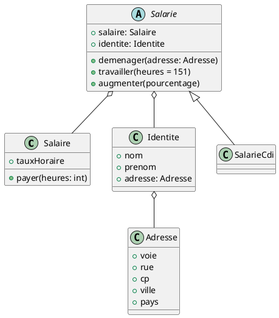

# testsJava
Exercices pour pratiquer les tests

&nbsp;
### README TP 2
Exercice pour apprendre à utiliser les mocks\
C'est pas fini :scream_cat: :hankey: :coffee: :octopus:

&nbsp;
#### Consignes ⚙️
Vous devez utiliser JUnit 5 pour les tests unitaires\
Vous devez utiliser Mockito pour les mocks\
Vous devez utiliser Maven pour gérer les dépendances et les tests\
Vous utiliserez des tests paramétrés lorsque cela est possible\
_Libre à vous d'utiliser les auto-mocks ou les mocks manuels !_

&nbsp;
#### Diagramme de classe

&nbsp;
#### Organisation du code 
Le package tp2 dans 'main/java/exercices/tp2' contient les classes:
- Adresse
- Identie
- Salaire
- Salarie (Classe abstraite)
- SalarieCdi 

Le package tp2 dans 'test/java/exercices/tp2' contient les tests pour les classes:
- AdresseTest
- IdentiteTest
- SalaireTest
- SalarieTest
- SalarieCdiTest

&nbsp;
#### Outils utilisés

Le TP a été réalisé à l'aide de JUnit 5 pour passer les tests unitaires et Mockito pour créer les mocks.\
La gestion des dépendances se fait à l'aide de Maven.

&nbsp;
#### Lancement des tests :man_scientist:

_Pour effectuer le lancement des tests :_\
_- Clic droit sur le package tp2 qui se situe dans 'main/java/exercices/tp2'_\
_- Sélectionner 'Run 'Test in 'exercices/tp2"' ou le raccourcis "Ctrl + Alt + F5"_

_Pour lancer les tests avec coverage :_\
_- Clic droit sur le package tp2 qui se situe dans 'main/java/exercices/tp2'_\
_- Sélectionner 'More Run/Debug' > 'Run 'Test in 'exercices/tp2" with Coverage'_

